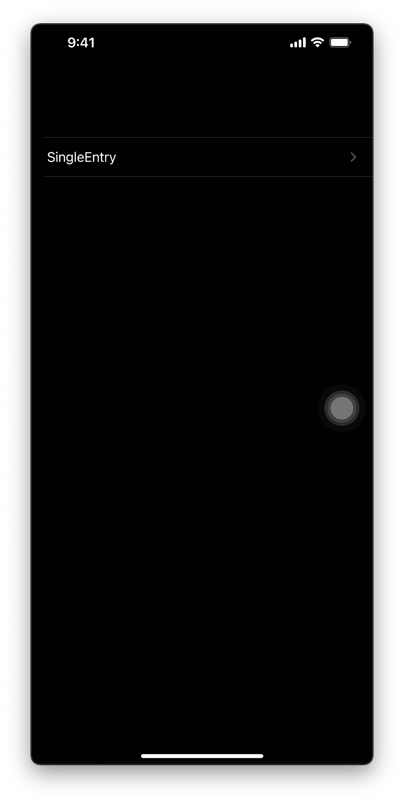
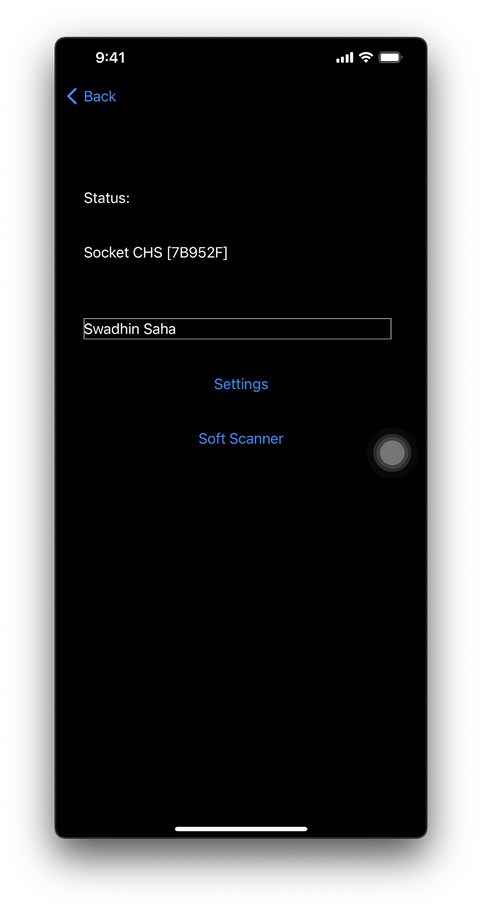
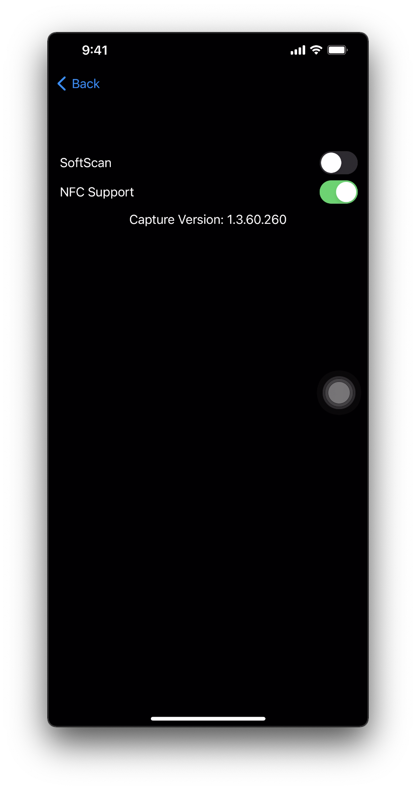

# SingleEntrySwiftUI for iOS
Simple iOS app with SwiftUI for showing the use of Capture SDK.

## IMPORTANT
When using/installing CocoaPods in a new project, the project workspace file should be used instead of the project file. Besides, some modification of info.plist is required, follow from this [link](https://github.com/SocketMobile/capturesingleentryswift-ios) 

## Detail
To learn more detail, see this link of [Socket Mobile Github](https://github.com/SocketMobile/capturesingleentryswift-ios) 
## Screenshots

## Screenshots

### Home View
The home view shows a list view with just one item: SingleEntry.

This view serves just as a demo of an application with multiple views. This view is aware about Capture, but does really nothing when a Socket Mobile device connects or scans a barcode.

### Main View
The main view shows the connection status, an edit box that receives the decoded data and a "settings" link to display the settings view.

When a scanner is connected, its friendly name appears in the status.

### Settings View
The settings view displays the Capture version, two switches to turn on or off the SoftScan feature and the D600 support. The done link closes this view to go back to the main view.

